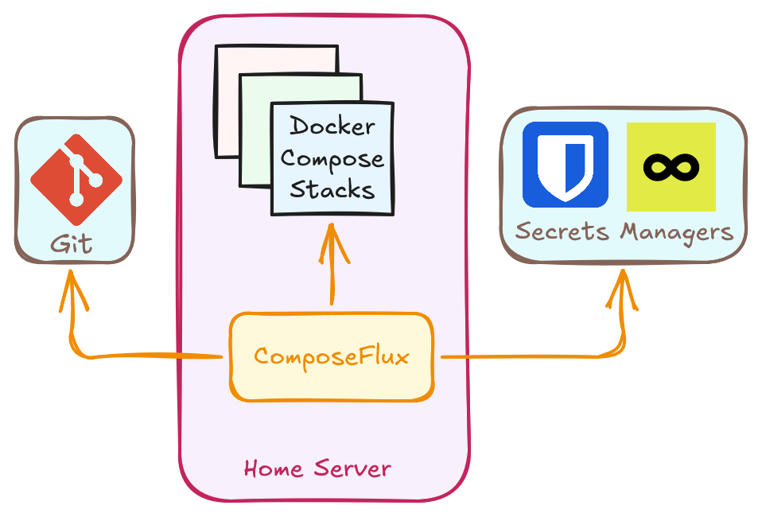

# Introduction

ComposeFlux is a GitOps tool for managing Docker Compose stacks on home servers. It watches a Git repository and
automatically deploys stacks when changes are detected.

## Goals

- Manage a few Docker Compose stacks on home servers
- No complex orchestration, clustering, or remote agents
- Local operation only - each server runs its own instance
- Just Git + Docker Compose + Secrets Manager

## How Sync Works



ComposeFlux runs a Git sync loop in daemon mode (`run` command). It performs an initial sync at startup, then checks the
remote Git repository for changes and syncs again when updates are detected.

Optionally, a separate cron-scheduled image update check (`IMAGE_UPDATE_SCHEDULE`) pulls new images and redeploys stacks
when a new image digest is detected.

1. Pulls latest commits
2. Fetches secrets from secrets manager
3. Loads environment variables from [`stack.yml`](#stack-configuration) (if present)
4. Discovers compose stacks (one level deep in `STACK_PATH`)
5. Calculates SHA256 hash for each stack
6. Deploys stacks with changed hashes (respects [`startup_order`](#stack-configuration))
7. Prunes stacks deleted from Git

## Hash-Based Change Detection

ComposeFlux uses a hash-based approach to decide whether a stack needs redeploying:

- SHA256 hash is calculated from the entire Compose project (after variable substitution with secrets)
- **Includes secrets**: The hash includes resolved secrets at sync time. If secrets change, you can run
  `composeflux sync` (or wait for the next Git change) to fetch them and update the hash.
- To take full advantage of hash-based detection for app config changes, prefer Docker Compose
  [`configs`](https://docs.docker.com/reference/compose-file/configs/) in your Compose files instead of mounting plain
  app config files directly into containers.
- Stack is redeployed only when the hash changes; otherwise it is skipped (no unnecessary redeployment)
- Hash is stored in the `composeflux.stack-hash` label on deployed containers

## Stack Configuration

Optional configuration file in the Git repository within the `STACK_PATH` directory that allows you to:

- Control deployment order (e.g., deploy Traefik first for proxy/certificates)
- Share environment variables across all stacks

The configuration file should be placed at `<repo>/<STACK_PATH>/stack.yml`.

**Directory structure:**

```
your-stacks-repo/
└── stacks/              ← STACK_PATH
    ├── stack.yml        ← Config file here
    ├── traefik/
    │   └── compose.yml
    ├── nextcloud/
    │   └── compose.yml
    └── jellyfin/
        └── compose.yml
```

**Example:**

```yaml
# Only list stacks that need specific order
# Everything else deploys in whatever order
startup_order:
  - traefik # Must match the directory name in STACK_PATH

# Common variables available to all stacks
envs:
  DOMAIN: homeserver.local
  TZ: America/New_York
  ENVIRONMENT: production
```

With this configuration, Traefik deploys first, then the rest of the stacks deploy in any order.

**Important Notes:**

- Scoped to `STACK_PATH` only - doesn't affect other directories
- Names in `startup_order` must match directory names exactly
- No need to list all stacks - only ones requiring specific order

## Multi-Server Setup

ComposeFlux runs **locally** on each server - there's no central controller or remote agents:

```
Server 1 (homeserver-1)          Server 2 (homeserver-2)
┌─────────────────────┐          ┌─────────────────────┐
│ ComposeFlux         │          │ ComposeFlux         │
│ → stacks/server-1/  │          │ → stacks/server-2/  │
└─────────────────────┘          └─────────────────────┘
         ↓                                ↓
    ┌────────────────────────────────────────┐
    │   Git Repository (shared)              │
    │   your-stacks-repo/                    │
    │   └── stacks/                          │
    │       ├── server-1/   ← Server 1 stacks│
    │       │   ├── app1/                    │
    │       │   └── app2/                    │
    │       └── server-2/   ← Server 2 stacks│
    │           ├── app3/                    │
    │           └── app4/                    │
    └────────────────────────────────────────┘
```

**Example Configuration:**

- **Server 1**: `STACK_PATH=stacks/server-1`
- **Server 2**: `STACK_PATH=stacks/server-2`

Each ComposeFlux instance only manages stacks in its configured directory.

## Limitations

- Nested stack discovery (only scans one level deep)
- Multi-server orchestration (no central controller)
- Rolling updates or zero-downtime deployments
- No active reconciliation of stack/container status (e.g., stopped/exited containers are not auto-redeployed). This
  used to be part of the implementation but was removed for simplicity. (💡 _Use Docker
  [restart policies](https://docs.docker.com/engine/containers/start-containers-automatically/) instead_)
- Built-in monitoring or alerting

**Stack Discovery is One Level Deep:**

```
stacks/
├── app1/            ← Discovered ✓
│   └── compose.yml
├── app2/            ← Discovered ✓
│   └── compose.yml
└── nested/
    └── app3/        ← NOT discovered ✗
        └── compose.yml
```

💡 _Use a flat structure. For multi-server setups, create separate directories per server._
