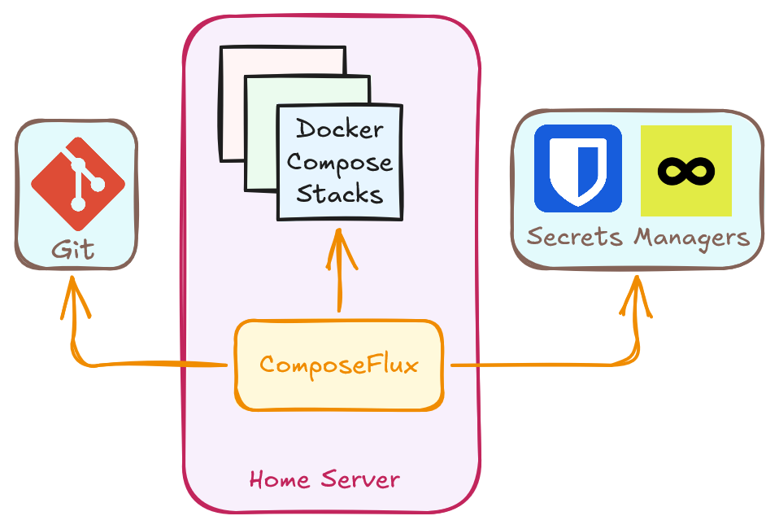

# Introduction

ComposeFlux is a GitOps tool for managing Docker Compose stacks on home servers. It watches a Git repository and
automatically deploys stacks when changes are detected.

## Goals

- Manage a few Docker Compose stacks on home servers
- No complex orchestration, clustering, or remote agents
- Local operation only - each server runs its own instance
- Just Git + Docker Compose + Secrets Manager

## How Sync Works



ComposeFlux runs a Git sync loop in daemon mode (`run` command). It performs an initial sync at startup, then checks the
remote Git repository for changes and syncs again when updates are detected.

1. Pulls latest commits
2. Fetches secrets from secrets manager
3. Loads environment variables from [`stack.yml`](#stack-configuration) (if present)
4. Discovers compose stacks (one level deep in `STACK_PATH`)
5. Calculates SHA256 hash for each stack
6. Deploys stacks with changed hashes (respects [`startup_order`](#stack-configuration))
7. Prunes stacks deleted from Git

Optionally, a separate cron-scheduled image update check (`IMAGE_UPDATE_SCHEDULE`) pulls new images and redeploys stacks
when a new image digest is detected.

Two additional background loops run independently:

- **Health reconciliation** — checks all managed stacks on `HEALTH_RECONCILE_INTERVAL` (disabled by default) and redeploys any
  that are stopped or have exited/dead containers
- **Docker resource prune** — prunes unused images, volumes, and build cache on `PRUNE_INTERVAL` (default: 24h), but
  only when all managed stacks are healthy (see [Periodic Docker Resource Pruning](#periodic-docker-resource-pruning))

## Hash-Based Change Detection

ComposeFlux uses a hash-based approach to decide whether a stack needs redeploying:

- SHA256 hash is calculated from the entire Compose project (after variable substitution with secrets)
- **Includes secrets**: The hash includes resolved secrets at sync time. If secrets change, you can run
  `composeflux sync` (or wait for the next Git change) to fetch them and update the hash.
- To take full advantage of hash-based detection for app config changes, prefer Docker Compose
  [`configs`](https://docs.docker.com/reference/compose-file/configs/) in your Compose files instead of mounting plain
  app config files directly into containers.
- Stack is redeployed only when the hash changes; otherwise it is skipped (no unnecessary redeployment)
- Hash is stored in the `composeflux.stack-hash` label on deployed containers

## Image Update Exclusion

Exclude stacks from automatic image updates by adding the `composeflux.image-update.exclude: "true"` label to any
service. **If any service has this label, the entire stack is skipped.**

**Example:**

```yaml
services:
  db:
    image: postgres:15
    labels:
      composeflux.image-update.exclude: "true"
```

**Notes: If ANY service has the label, the entire stack is excluded**

## Stack Configuration

Optional configuration file in the Git repository within the `STACK_PATH` directory that allows you to:

- Control deployment order (e.g., deploy Traefik first for proxy/certificates)
- Share environment variables across all stacks

The configuration file should be placed at `<repo>/<STACK_PATH>/stack.yml`.

**Directory structure:**

```
your-stacks-repo/
└── stacks/              ← STACK_PATH
    ├── stack.yml        ← Config file here
    ├── traefik/
    │   └── compose.yml
    ├── nextcloud/
    │   └── compose.yml
    └── jellyfin/
        └── compose.yml
```

**Example:**

```yaml
# Only list stacks that need specific order
# Everything else deploys in whatever order
startup_order:
  - traefik # Must match the directory name in STACK_PATH

# Common variables available to all stacks
envs:
  DOMAIN: homeserver.local
  TZ: America/New_York
  ENVIRONMENT: production
```

With this configuration, Traefik deploys first, then the rest of the stacks deploy in any order.

**Important Notes:**

- Scoped to `STACK_PATH` only - doesn't affect other directories
- Names in `startup_order` must match directory names exactly
- No need to list all stacks - only ones requiring specific order

## Multi-Server Setup

ComposeFlux runs **locally** on each server - there's no central controller or remote agents:

```
Server 1 (homeserver-1)          Server 2 (homeserver-2)
┌─────────────────────┐          ┌─────────────────────┐
│ ComposeFlux         │          │ ComposeFlux         │
│ → stacks/server-1/  │          │ → stacks/server-2/  │
└─────────────────────┘          └─────────────────────┘
         ↓                                ↓
    ┌────────────────────────────────────────┐
    │   Git Repository (shared)              │
    │   your-stacks-repo/                    │
    │   └── stacks/                          │
    │       ├── server-1/   ← Server 1 stacks│
    │       │   ├── app1/                    │
    │       │   └── app2/                    │
    │       └── server-2/   ← Server 2 stacks│
    │           ├── app3/                    │
    │           └── app4/                    │
    └────────────────────────────────────────┘
```

**Example Configuration:**

- **Server 1**: `STACK_PATH=stacks/server-1`
- **Server 2**: `STACK_PATH=stacks/server-2`

Each ComposeFlux instance only manages stacks in its configured directory.

## Proactive Stack Health Reconciliation

In addition to Git-triggered syncs, ComposeFlux periodically checks all managed stacks and redeploys any that are
unhealthy. This catches stacks that stopped, crashed, or were manually shut down between git ticks — without relying
solely on Docker restart policies.

**A container is considered healthy if:**

- Its state is `running`, OR
- Its state is `exited` with exit code 0 **and** it has the `composeflux.init: "true"` label

Everything else (`dead`, `paused`, `exited` without the init label, non-zero exit) is unhealthy. A stack is unhealthy
if any of its containers are unhealthy.

`restarting` containers are unhealthy — they are not `running`. If you want Docker's own restart policy to handle
recovery without ComposeFlux intervening, use the [Suspend Label](#suspend-label) to pause health reconciliation for
that stack.

**Init containers:** If your stack uses init containers (short-lived containers that run setup tasks and exit), mark them
with the `composeflux.init: "true"` label so ComposeFlux treats a clean exit (code 0) as healthy:

```yaml
services:
  migrate:
    image: flyway:latest
    labels:
      composeflux.init: "true"
  app:
    image: myapp:latest
    depends_on:
      migrate:
        condition: service_completed_successfully
```

Without this label, an exited container (even with exit code 0) is treated as unhealthy and triggers a redeploy.

**Recovery action:** ComposeFlux calls `docker compose up` using the existing project config (no git pull). The git
ticker continues to handle source drift independently.

**Max attempts:** After 3 consecutive deploy failures for a stack, health reconciliation skips that stack and logs a
warning. The counter resets on the next successful git sync or successful image update.

Configure the check interval with `HEALTH_RECONCILE_INTERVAL` (default: disabled). Set to e.g. `5m` to enable.

## Suspend Label

You can pause reconciliation for a specific stack by adding the `composeflux.suspend: "true"` label to any service in
the stack's compose file:

```yaml
services:
  db:
    image: postgres:15
    labels:
      composeflux.suspend: "true"
```

Commit the change — ComposeFlux will redeploy with the label applied. To resume reconciliation, remove the label and
commit again.

**When any container in a stack has this label:**

- The health reconciliation loop skips that stack entirely
- The Docker resource prune loop aborts and skips pruning for the entire run

This is useful during maintenance operations — for example, labelling a database service as suspended before stopping it
for a backup (`docker stop postgres`) without triggering an immediate reconcile that would restart it.

## Periodic Docker Resource Pruning

When `PRUNE_INTERVAL` is set, ComposeFlux runs a periodic prune cycle (default: every `24h`, configurable via
`PRUNE_INTERVAL`) to reclaim disk space from unused Docker resources. Set `PRUNE_INTERVAL=0` to disable pruning entirely.

**What is pruned:** dangling (untagged) images, volumes, build cache. Containers and networks are not pruned.

**Safety guard:** The prune cycle only runs when **all** composeflux-managed stacks are healthy. If any stack is
stopped, degraded, or has the `composeflux.suspend=true` label set, the prune cycle is skipped for that interval and
a warning is logged.

## Blog Posts

To learn more about the motivation behind ComposeFlux and see it in action:

- [GitOps for Homeservers (Part 1) — My Homeservers, Ansible, and the Pain Points](https://veerendra2.github.io/gitops-for-homeservers-part1)
- [GitOps for Homeservers (Part 2) — Searching for the Right Tool](https://veerendra2.github.io/gitops-for-homeservers-part2)
- [GitOps for Homeservers (Part 3) — ComposeFlux: A Lightweight GitOps Tool](https://veerendra2.github.io/gitops-for-homeservers-part3)
- [How I Manage My Homeservers with GitOps and Docker Compose](https://medium.com/p/1da41b3680a4) (Medium)

## Limitations

- Nested stack discovery (only scans one level deep)
- Multi-server orchestration (no central controller)
- Rolling updates or zero-downtime deployments
- Built-in monitoring or alerting

**Stack Discovery is One Level Deep:**

```
stacks/
├── app1/            ← Discovered ✓
│   └── compose.yml
├── app2/            ← Discovered ✓
│   └── compose.yml
└── nested/
    └── app3/        ← NOT discovered ✗
        └── compose.yml
```

💡 _Use a flat structure. For multi-server setups, create separate directories per server._
