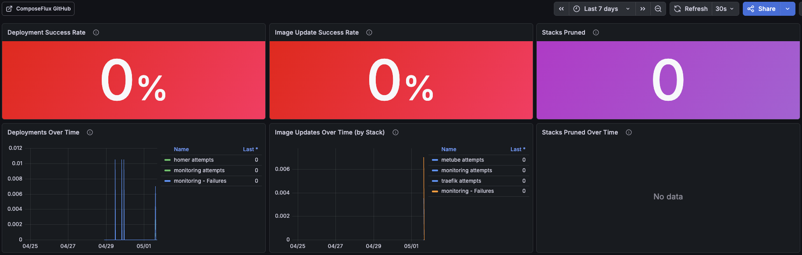

# Prometheus Metrics

ComposeFlux exposes Prometheus metrics on the address configured via `METRICS_ADDR` (default `:9090`). Set it to empty to disable.

## Available Metrics

| Metric | Type | Labels | Description |
| ------ | ---- | ------ | ----------- |
| `composeflux_deployments_total` | Counter | `stack_name` | Total number of stack deployment attempts |
| `composeflux_deployment_failures_total` | Counter | `stack_name` | Total number of failed stack deployments |
| `composeflux_image_updates_total` | Counter | `stack_name` | Total number of stack image update attempts |
| `composeflux_image_update_failures_total` | Counter | `stack_name` | Total number of failed stack image updates |
| `composeflux_stacks_pruned_total` | Counter | `stack_name` | Total number of managed stacks removed during pruning |

## Grafana Dashboard

A pre-built Grafana dashboard is available at [`docs/dashboards/grafana-dashboard.json`](dashboards/grafana-dashboard.json).

Import it via Grafana UI (**Dashboards → Import → Upload JSON file**) or use the [Grafana HTTP API](https://grafana.com/docs/grafana/latest/developers/http_api/dashboard/#create--update-dashboard).

