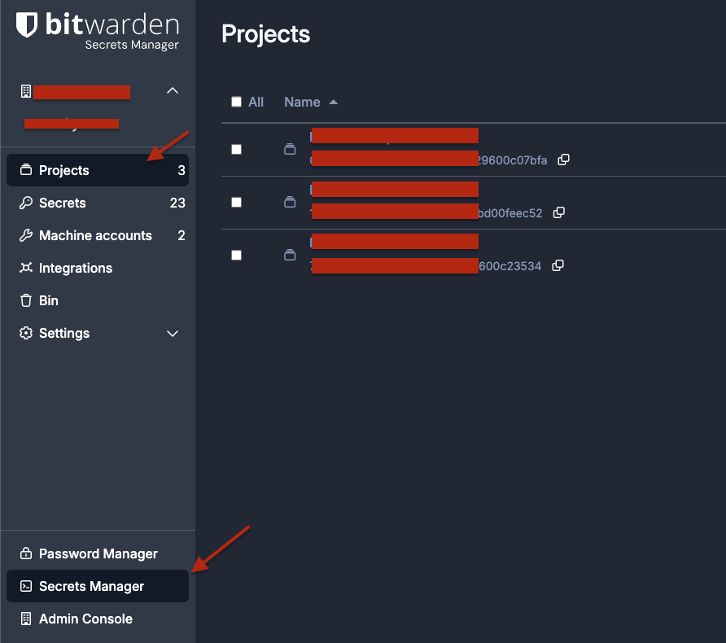
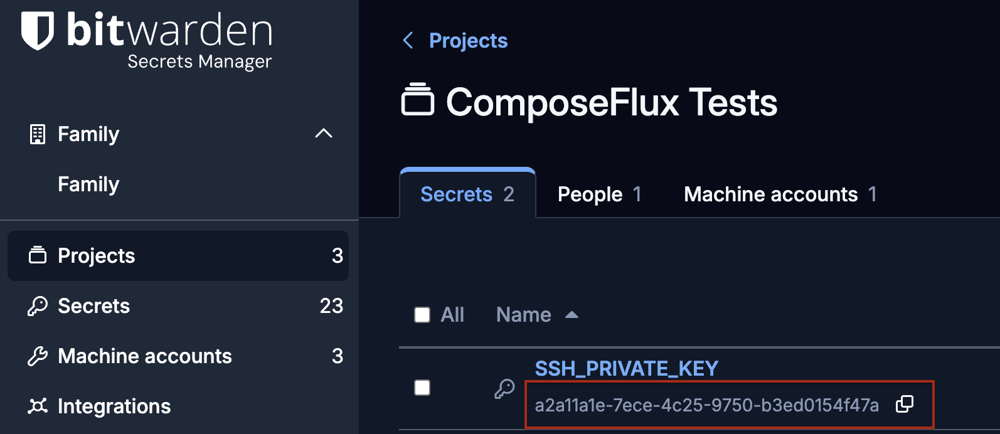
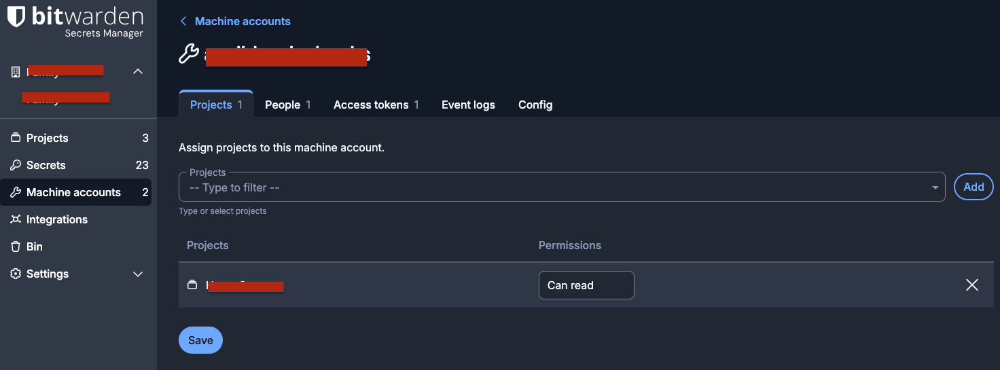
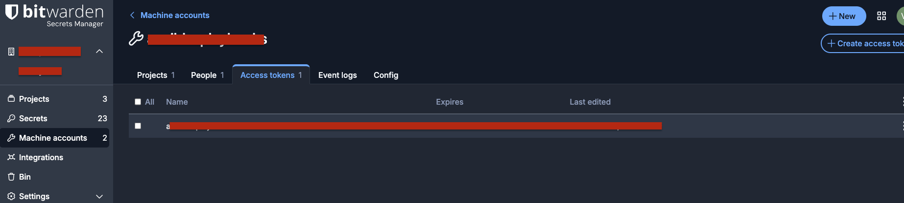
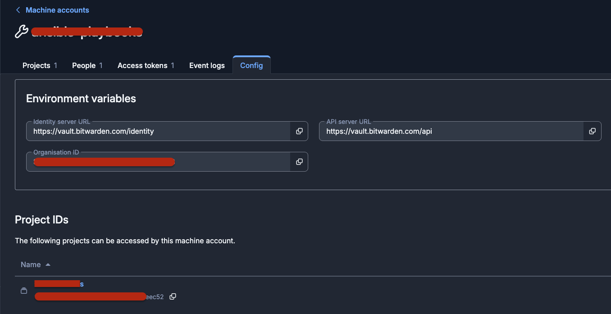

# Bitwarden Secrets Manager Setup

Set up Bitwarden Secrets Manager as the secrets provider for ComposeFlux.

> See [Bitwarden Secrets Manager Overview](https://bitwarden.com/help/secrets-manager-overview/) for product details.

## Steps

### 1. Create a Project

1. Sign in to Bitwarden.
2. Open **Secrets Manager**.
3. Click **New Project**.
4. Create a project for ComposeFlux secrets.



### 2. Add Secrets

Add secrets to the project.

- If you want ComposeFlux to fetch your Git SSH deploy key from Bitwarden at startup, create a secret that stores the
  private key, then copy that secret's ID for `GIT_DEPLOY_KEY_SECRET_REF`. See
  [Deploy Key Secret Reference](../GettingStarted.md#deploy-key-secret-reference).



- Add any stack secrets you want exposed as environment variables (for example, `DATABASE_URL`, `API_KEY`).

### 3. Create a Machine Account

1. Go to the **Machine Accounts** tab.
2. Click **New Machine Account**.
3. Assign the project you created.
4. Set permission to **Can read**.
5. Click **Save**.



### 4. Generate an Access Token

1. Open the machine account.
2. Go to the **Access tokens** tab.
3. Click **Create access token**.
4. Copy and store the token.



### 5. Configuration Checklist

Make sure you have the following values for ComposeFlux:

- **Organization ID**
- **Project ID**
- **API URL** (default: `https://vault.bitwarden.com/api`)
- **Identity URL** (default: `https://vault.bitwarden.com/identity`)



## Environment Variables

Add to your `.env` or compose file:

```bash
SECRETS_PROVIDER=bitwarden
BITWARDEN_ACCESS_TOKEN=<your-access-token>
BITWARDEN_ORGANIZATION_ID=<your-org-id>
BITWARDEN_PROJECT_ID=<your-project-id>

# Optional: only if fetching SSH deploy key from Bitwarden
GIT_DEPLOY_KEY_SECRET_REF=<bitwarden-secret-id>

# Optional: only for self-hosted Bitwarden
# BITWARDEN_API_URL=https://vault.bitwarden.com/api
# BITWARDEN_IDENTITY_URL=https://vault.bitwarden.com/identity
```

## Usage in Compose Stacks

ComposeFlux fetches secrets from the configured Bitwarden project and exposes them as environment variables using each
secret key name.

```yaml
services:
  app:
    image: myapp:latest
    environment:
      DATABASE_URL: ${DATABASE_URL}
      API_KEY: ${API_KEY}
```
