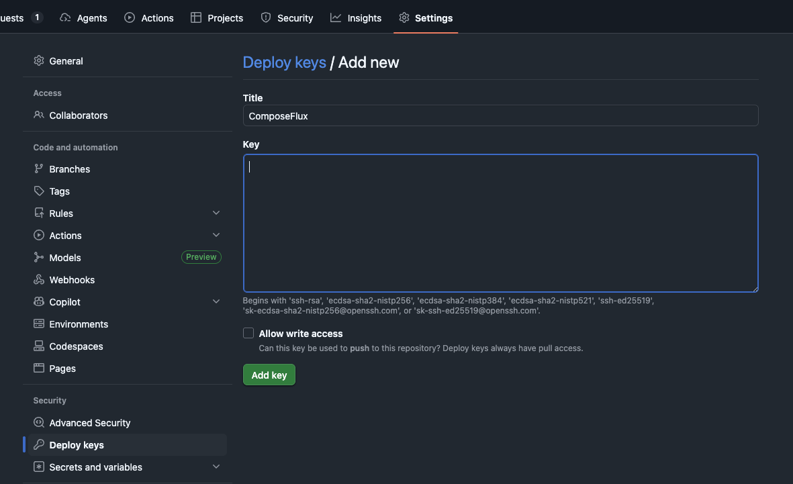

# GitHub Deploy Keys Setup

Set up read-only SSH deploy keys for secure Git access.

You can follow a similar approach for other Git providers.

## Generate SSH Key Pair

```bash
# Generate new key pair (no passphrase for automation)
ssh-keygen -t ed25519 -C "composeflux-deploy-key" -f ~/.ssh/composeflux_deploy

# This creates:
# - Private key: ~/.ssh/composeflux_deploy
# - Public key: ~/.ssh/composeflux_deploy.pub
```

## Add Public Key to GitHub

1. Copy public key: `~/.ssh/composeflux_deploy.pub`
2. Go to your GitHub repository, **Settings** → **Deploy keys** → Click **Add deploy key**



## Add Private Key to Secrets Manager

For more details, see:

- [Bitwarden Add Secrets](Bitwarden.md#2-add-secrets)
- [Infisical Add Secrets](Infisical.md#3-add-secrets)

### For Bitwarden

1. Copy private key: `~/.ssh/composeflux_deploy`
2. In Bitwarden Secrets Manager, create a secret named `SSH_PRIVATE_KEY`.
3. Paste the entire private key (include `-----BEGIN` and `-----END` lines).
4. Assign the secret to the ComposeFlux project.

### For Infisical

1. Copy private key: `~/.ssh/composeflux_deploy`
2. In Infisical, go to your ComposeFlux project.
3. Add a secret named `SSH_PRIVATE_KEY`.
4. Paste the entire private key content.

## Configure ComposeFlux

ComposeFlux automatically fetches `SSH_PRIVATE_KEY` from your secrets manager (default behavior).

**No additional configuration needed** - just ensure:

```yaml
# In compose.yml
environment:
  GIT_REPO_URL: git@github.com:user/repo.git # SSH URL
  # GIT_DEPLOY_KEY_SECRET_REF: SSH_PRIVATE_KEY  # Default, change if using different name
```

## Alternative: Mount Local Key

Skip secrets manager and mount key directly:

```yaml
# In compose.yml
environment:
  GIT_DEPLOY_KEY_SECRET_REF: "" # Empty string disables fetch from secrets manager
  GIT_SSH_KEY_PATH: /.ssh/composeflux_id_rsa # Where the key will be mounted

volumes:
  - ~/.ssh/composeflux_deploy:/.ssh/composeflux_id_rsa:ro
```

This bypasses the secrets manager for SSH keys entirely. Useful if you manage SSH keys separately or don't want to store them in Bitwarden/Infisical.

## Test SSH Access

```bash
# Test GitHub connection with your key
ssh -i ~/.ssh/composeflux_deploy -T git@github.com

# Expected output:
# Hi user/repo! You've successfully authenticated, but GitHub does not provide shell access.
```
