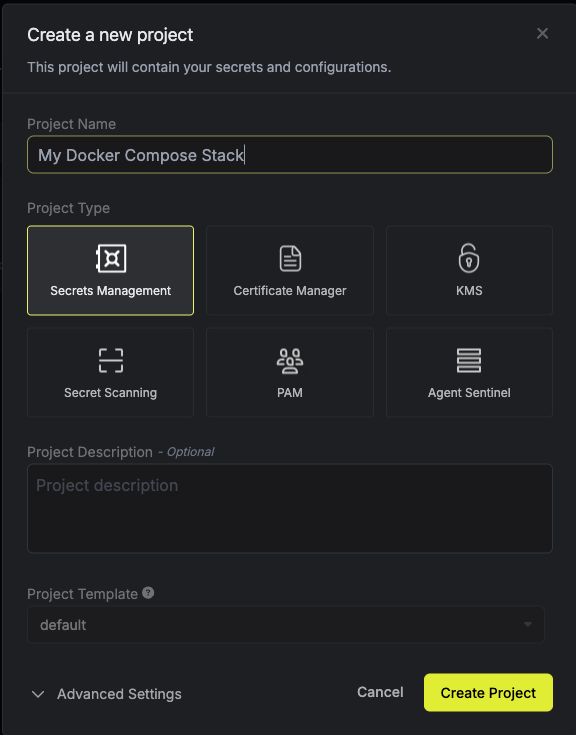
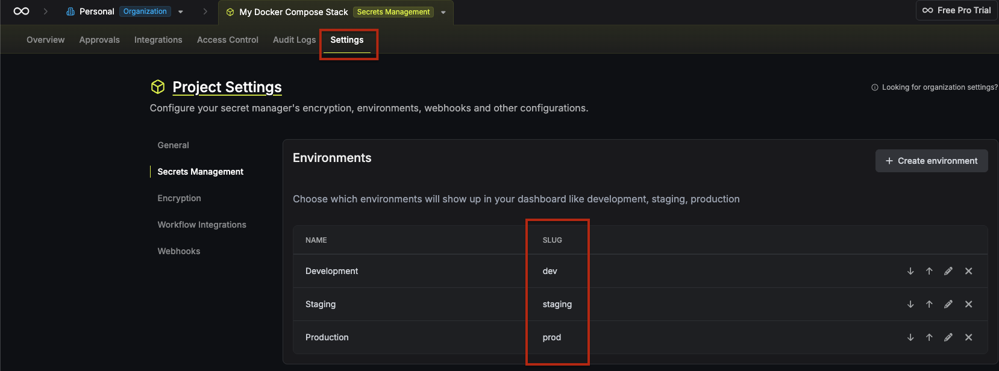
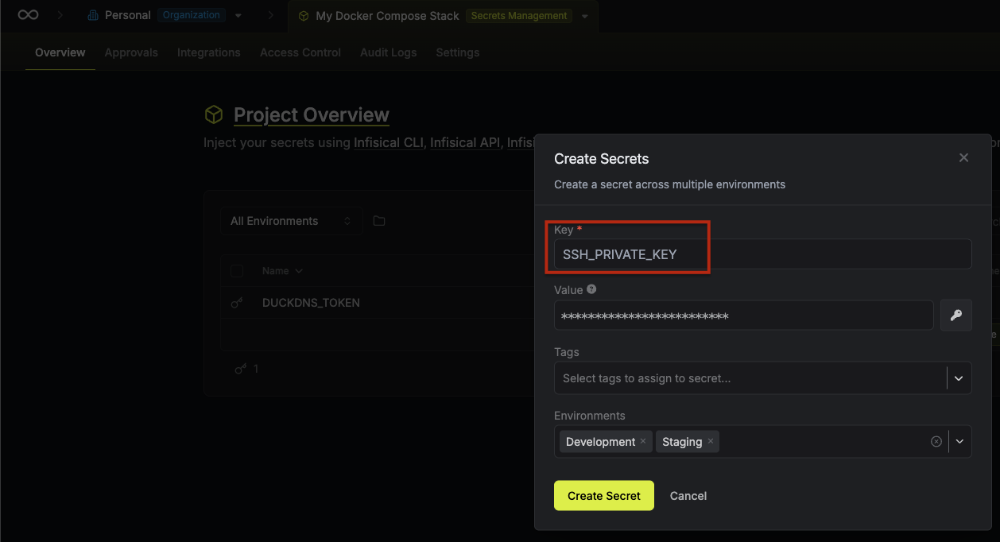
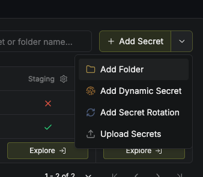
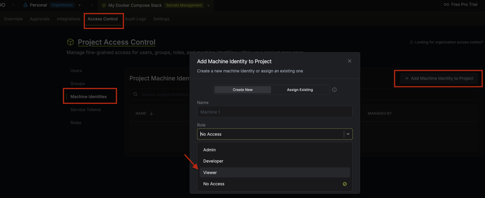
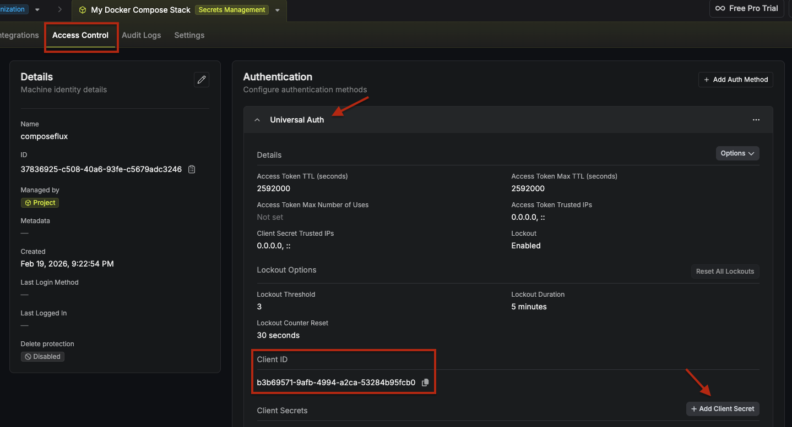
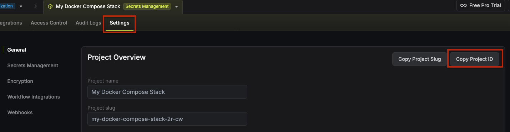

# Infisical Secrets Manager Setup

Set up Infisical as the secrets provider for ComposeFlux.

> See [Infisical Documentation](https://infisical.com/docs) for more details.

## Steps

### 1. Create a Project

1. Sign in to Infisical.
2. Open the **Overview** tab.
3. Click **Add New Project**.
4. Create a project for ComposeFlux secrets.



### 2. Create or Choose an Environment

ComposeFlux uses `INFISICAL_ENVIRONMENT`, so you must provide an environment slug.

1. Open your project.
2. Create or choose an environment (for example, `prod` or `dev`).
3. Note the environment slug value.



### 3. Add Secrets

Add secrets in the project environment you selected:

- If you want ComposeFlux to fetch your Git SSH deploy key from Infisical at startup, create a secret with key `SSH_PRIVATE_KEY` (or another key name and set `GIT_DEPLOY_KEY_SECRET_REF` to match). See [Deploy Key Secret Reference](../GettingStarted.md#deploy-key-secret-reference).



- Add stack secrets you want exposed as environment variables (for example, `DATABASE_PASSWORD`, `API_KEY`).

### 4. Create Folders (Optional)

Infisical supports organizing secrets in folders. If you use folders, set `INFISICAL_SECRET_PATH` to the folder path used by ComposeFlux.

1. In the **Overview** tab, click **Add Secrets** and select **Add Folder**.
2. Note the folder path (for example, `/`, `/apps/prod`).



### 5. Create Machine Identity

1. Go to **Project Settings** -> **Access Control** -> **Machine Identities**.
2. Click **Add Machine Identity to Project**.
3. Give the machine identity a name and set **Role** to **Viewer**.



### 6. Generate Client Credentials

1. Open the machine identity you created.
2. Expand the **Universal Auth** section in the **Authentication** tab.
3. Click **Add Client Secrets**.
4. Copy the **Client ID** and **Client Secret**.



### 7. Configuration Checklist

Make sure you have the following values for ComposeFlux:

- **Client ID** - From Universal Auth credentials
- **Client Secret** - From Universal Auth credentials
- **Environment** - Environment slug (for example, `prod`, `dev`)
- **Secret Path** - Folder path where secrets are located (default: `/`)
- **Site URL** - For self-hosted only (default: `https://app.infisical.com`)
- **Project ID** - Found in project settings (see screenshot below)



## Environment Variables

Add to your `.env` or compose file:

```bash
SECRETS_PROVIDER=infisical
INFISICAL_CLIENT_ID=<your-client-id>
INFISICAL_CLIENT_SECRET=<your-client-secret>
INFISICAL_ENVIRONMENT=prod
INFISICAL_PROJECT_ID=<your-project-id>

# Optional
INFISICAL_SECRET_PATH=/
# INFISICAL_SITE_URL=https://app.infisical.com

# Optional: only if using a custom key name for SSH deploy key
# GIT_DEPLOY_KEY_SECRET_REF=SSH_PRIVATE_KEY
```

## Usage in Compose Stacks

ComposeFlux fetches secrets from the configured Infisical project/environment/path and exposes them as environment variables using each secret key name.

```yaml
services:
  app:
    image: myapp:latest
    environment:
      DATABASE_PASSWORD: ${DATABASE_PASSWORD}
      API_KEY: ${API_KEY}
```
